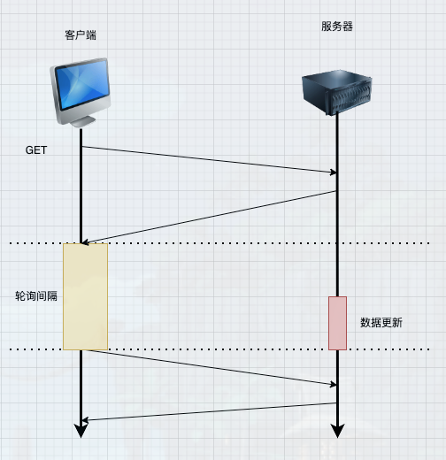

# webSocket

>  当我们邮箱中，每当收到一封邮件时，未读邮件的总数都会自动加1，而这种消息则是服务推送给客户端的

## 一、常见的消息推送

### 1.常见消息推送方式

> 轮询 、 长轮询、 webSocket、 SSE


#### 1.1 轮询



> 客户端1以固定的时间间隔向服务器发送请求，服务器接收到请求，将数据返回给客户端


- 轮询的优点

    - 轮询是一种简单的获取服务器更新的方法，易于理解和实现
    - 轮询基于http请求和响应，兼容网络服务器和客户端

- 轮询的缺点

    - 客户端必须等下一次轮询才能接收到新数据，可能导致更新不及时
    - 在没有数据更新的情况下，频繁轮询是无效的

```js
setInterval(()=>{
    axios()
},10000)
```

#### 1.2 长轮询

> 长轮询是一种改进的轮询技术，客户端向服务器发送 HTTP 请求。服务器收到请求后，会阻塞请求，直到有新数据或者达到指定的超时时间才会返回结果

- 如果有新数据，服务器会立即返回结果并关闭连接

- 如果没有新数据，服务器会在超时后关闭连接

- 客户端收到响应或连接超时，会再次发送新的请求


- 长轮询的优点

    - 减少客户端俩次请求之间的等待时间
    - 长轮询减少了在没有数据更新时的无效请求次数，因为服务器仅在数据准备好时才发送响应

- 长轮询的缺点

     - 虽然长轮询减少了请求次数，但它可能会长时间占用服务器资源，因为服务器需要保持连接打开直到有新数据出现或超时

     - 长轮询的实现比简单的轮询复杂，需要服务器端编写额外的逻辑

#### 1.3 SSE

> SSE服务器发送时间、主要哟哦难怪乎服务器向客户端推送实时更新，不需要客户端主动请求


#### 1.4 webSocket

> WebSocket是一种在单个TCP连接上全双工通信的协议，它能够实现客户端和服务器之间的实时通信，能够提供更快、更稳定的通信效果


``补充说明``
- 全双工:全双工通信允许数据同时在两个方向上传输，即有两个信道，因此允许同时进行双向传

- 半双工:但某一时刻只允许信号在一个信道上单向传输。因此，半双工通信实际上是一种可切换方向的单工通信。