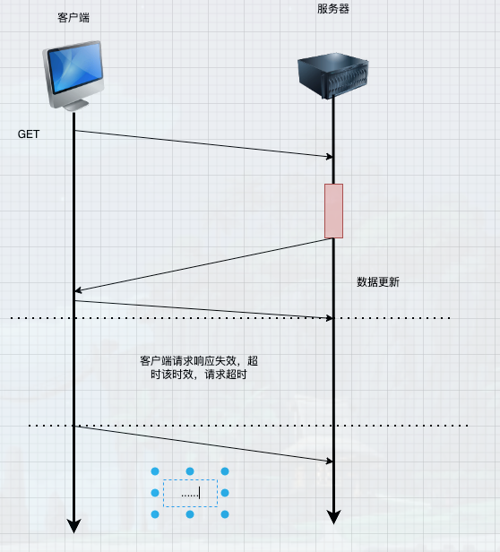

# webSocket

>  当我们邮箱中，每当收到一封邮件时，未读邮件的总数都会自动加1，而这种消息则是服务推送给客户端的

## 一、常见的消息推送

### 1.常见消息推送方式

> 轮询 、 长轮询、 webSocket、 SSE


#### 1.1 轮询


> 客户端1以固定的时间间隔向服务器发送请求，服务器接收到请求，将数据返回给客户端


- 轮询的优点

    - 轮询是一种简单的获取服务器更新的方法，易于理解和实现
    - 轮询基于http请求和响应，兼容网络服务器和客户端

- 轮询的缺点

    - 客户端必须等下一次轮询才能接收到新数据，可能导致更新不及时
    - 在没有数据更新的情况下，频繁轮询是无效的

```js
setInterval(()=>{
    axios()
},10000)
```

#### 1.2 长轮询

> 长轮询是一种改进的轮询技术，客户端向服务器发送 HTTP 请求。服务器收到请求后，会阻塞请求，直到有新数据或者达到指定的超时时间才会返回结果

- 如果有新数据，服务器会立即返回结果并关闭连接

- 如果没有新数据，服务器会在超时后关闭连接

- 客户端收到响应或连接超时，会再次发送新的请求


- 长轮询的优点

    - 减少客户端俩次请求之间的等待时间
    - 长轮询减少了在没有数据更新时的无效请求次数，因为服务器仅在数据准备好时才发送响应

- 长轮询的缺点

     - 虽然长轮询减少了请求次数，但它可能会长时间占用服务器资源，因为服务器需要保持连接打开直到有新数据出现或超时

     - 长轮询的实现比简单的轮询复杂，需要服务器端编写额外的逻辑

#### 1.3 SSE

> SSE服务器发送时间、主要哟哦难怪乎服务器向客户端推送实时更新，不需要客户端主动请求


#### 1.4 webSocket

> WebSocket是一种在单个TCP连接上全双工通信的协议，它能够实现客户端和服务器之间的实时通信，能够提供更快、更稳定的通信效果


``补充说明``
- 全双工:全双工通信允许数据同时在两个方向上传输，即有两个信道，因此允许同时进行双向传

- 半双工:但某一时刻只允许信号在一个信道上单向传输。因此，半双工通信实际上是一种可切换方向的单工通信。


``实现一个简易聊天室``

> 前端部分
```vue
<script setup>
import io from 'socket.io-client'
import {ref,onMounted} from 'vue'
const messageArr = ref([])
const message = ref('')
let socket = io('http://192.168.2.23:3000')
let userId = ref('')
const sendMessageRef = ref(null)
function init() {
    //初始化

    //监听服务器发送的消息
    socket.on('connection', (sockets) => {
       console.log("连接成功");
       
       
    })


    socket.on('message', (data) => {
        
       if(data.type === 'init'){
         alert(data.message)
       }else{
         messageArr.value.push(data)
       }
       
   
    })
}


const handleSend = () => {
  if(!message.value.trim()){
      alert('发送信息不能为空')
      return
  }
   let data = {
       message:message.value.trim(),
       userId:userId.value,
       type:'message'
   }
    socket.emit('message',data)
    message.value = '' 
}
onMounted(()=>{
    userId.value =`用户${parseInt(Math.random() * 100 )}`    
    init()
})
</script>

<template> 
    <div class="container">
        <div class="content">
            <div class="top">
            </div>

            <div class="sendMessage" ref="sendMessageRef">
                <div class="item" v-for="item in messageArr" :key="item.userId">
                    <div class="item-left" v-if="item.userId !== userId">
                        <div class="avatar">
                            {{ item.userId }}
                        </div>
                        <div class="message">
                           {{ item.message }}
                        </div>
                    </div>
                    <div class="item-right" v-else>
                        <div class="message">
                            {{ item.message  }}
                        </div>
                        <div class="avatar">
                           {{ item.userId }}
                        </div>
                    </div>
                </div>
            </div>
            <div class="footer">
                <input type="text" class="input" v-model="message" />
                <button class="btn" @click="handleSend">发送</button>
            </div>

        </div>
    </div>
</template>

<style scoped>
* {
    margin: 0;
    padding: 0;
}

.container {
    width: 100vw;
    height: 100vh;
    display: flex;
    align-items: center;
    justify-content: center;


    .content {
        width: 800px;
        height: 800px;
        background-color: aqua;

        .top {
            height: 50px;
            display: flex;
            align-items: center;
            background-color: #f5f5f5;
        }

        .sendMessage {
            height: 700px;
            overflow: auto;
            .item{
               
                display: flex;
                flex-direction: column;

                .item-left{
                    margin: 20px;
                    display: flex;
                    align-items: center;
                    .avatar{
                       width: 100px;
                       height: 100px;
                       border-radius: 50%;
                       display: flex;
                          justify-content: center;
                          align-items: center;
                          background-color: #f5f5f5;
                    };

                    .message{
                        margin: 0 20px;
                        height: 50px;
                        display: flex;
                        align-items: center;
                        background-color: #f5f5f5;
                        padding: 20px;
                    }
                }

                .item-right{
                    align-self: flex-end;
                    margin: 20px;
                    display: flex;
                    align-items: center;
                    .avatar{
                        width: 100px;
                        height: 100px;
                        border-radius: 50%;
                        display: flex;
                          justify-content: center;
                          align-items: center;
                          background-color: #f5f5f5;
                     };
 
                     .message{
                         margin: 0 20px;
                         height: 50px;
                         display: flex;
                         align-items: center;
                         background-color: #f5f5f5;
                         padding: 20px;
                     }
                }
            }
        }

        .footer {
            height: 50px;
            display: flex;
            align-items: center;
            justify-content: space-between;
            font-size: 50px;

            .input {
                height: 100%;
                width: 700px;
                font-size: 50px;
                padding: 0 !important;
            }

            .btn {
                font-size: 20px;
                width: 100px;
                height: 100%;
            }
        }
    }
}
</style>

```


> 后端部分

```js
// server.js
const express = require('express');
const http = require('http');
const { Server } = require('socket.io');

// 创建 Express 应用和 HTTP 服务器
const app = express();
const server = http.createServer(app);

// 创建 Socket.IO 实例
const io = new Server(server, {
    cors: {
        origin: "*"
    }
});


io.on('connection', (socket) => {
    console.log('用户已连接',socket.id);
    
    socket.send({
        type: "init",
        message: "欢迎连接"
    })
    
    socket.on('message', (msg) => {
        // 广播给所有用户
       
        
       io.emit('message', msg);
    });

    socket.on('disconnect', () => {
        console.log('用户已断开连接'); 
    })

})

// 提供静态文件（HTML、CSS、JS）
app.use(express.static('public'));
 


// 启动服务器，监听 3000 端口
server.listen(3000, () => {
    console.log('服务器已启动，访问 http://localhost:3000');
});


```